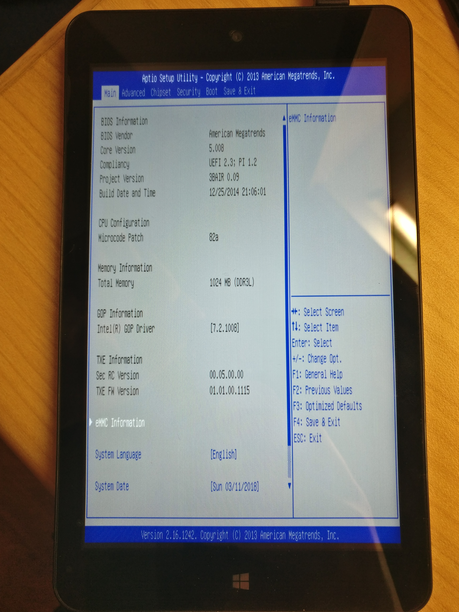
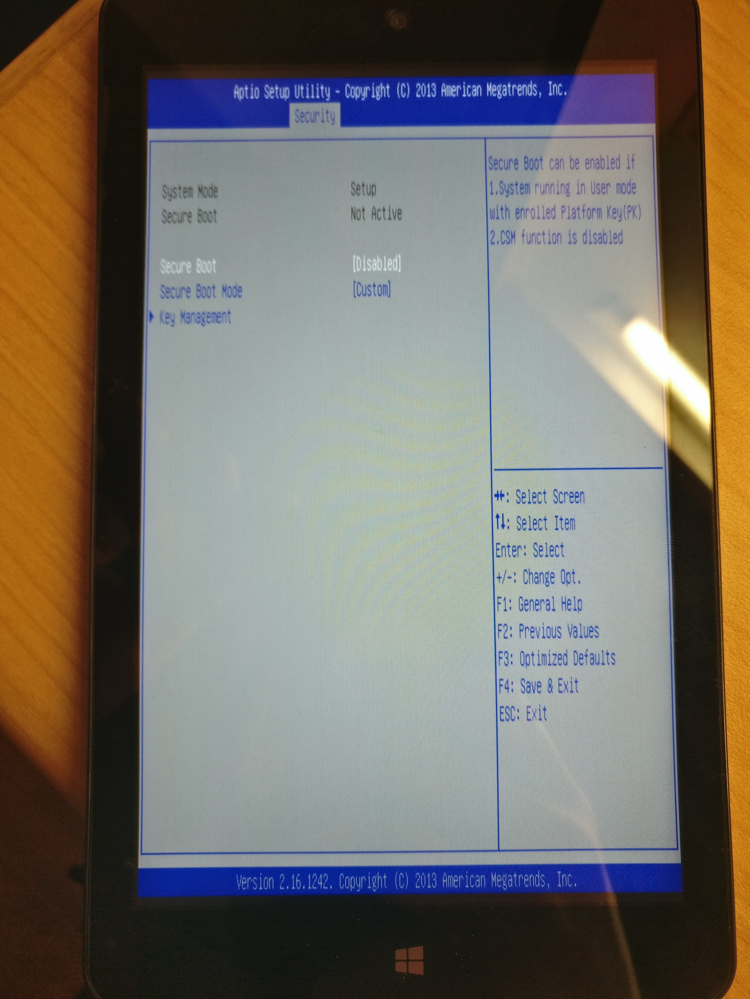
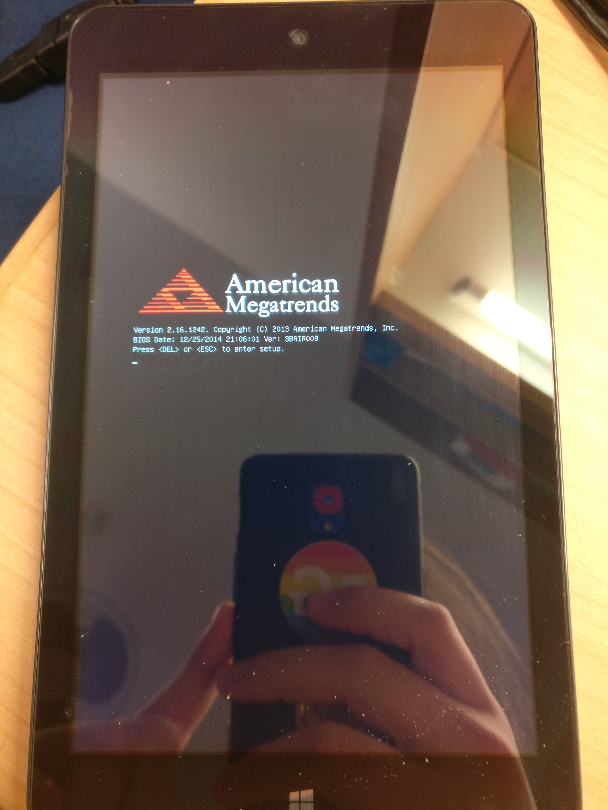
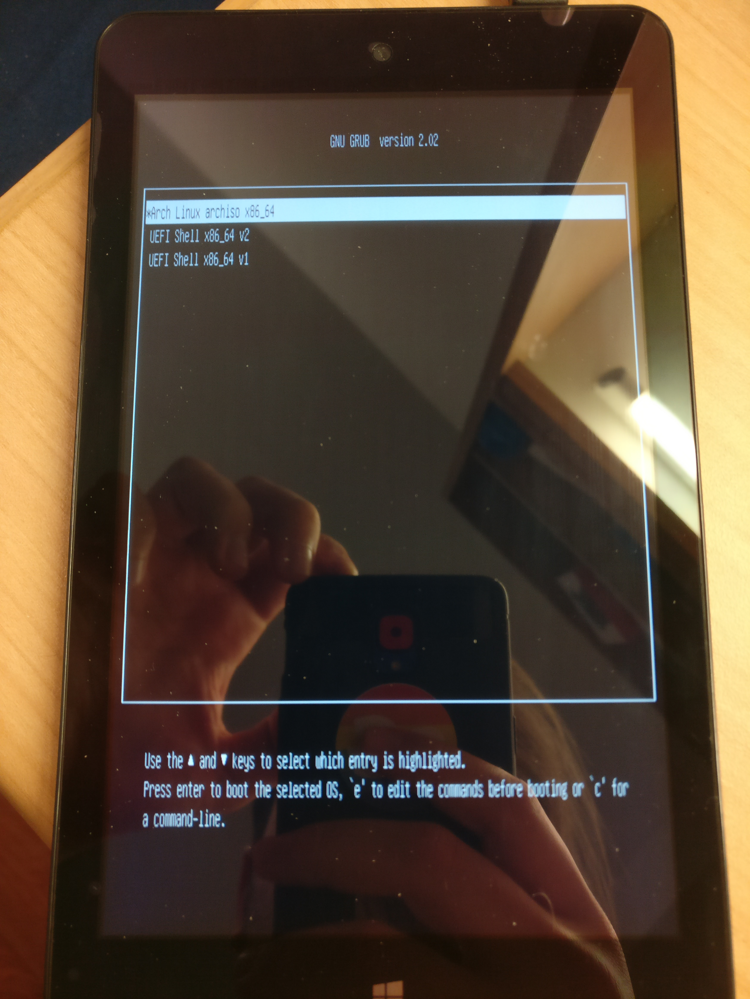
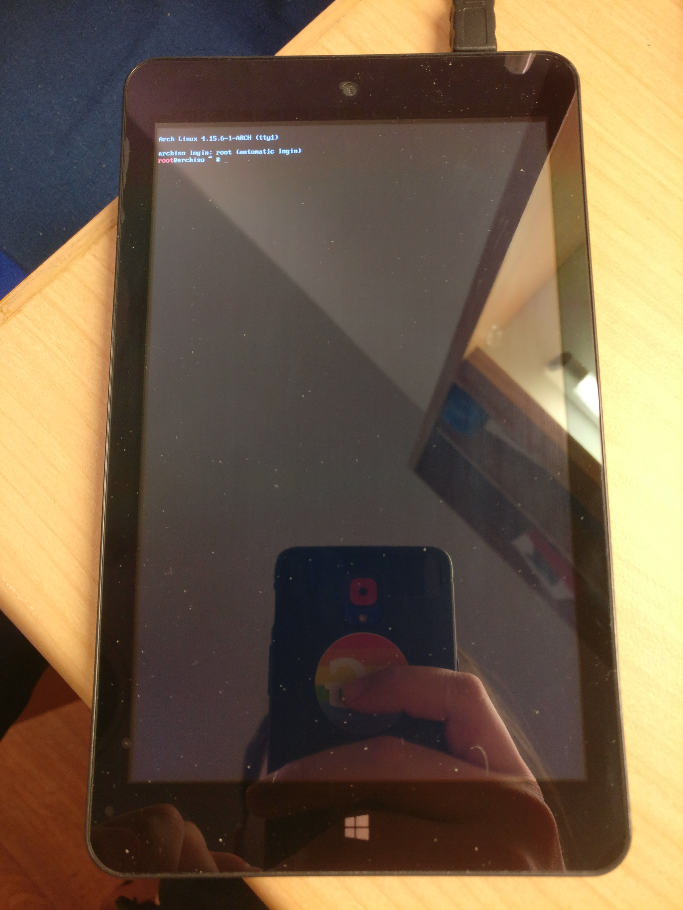
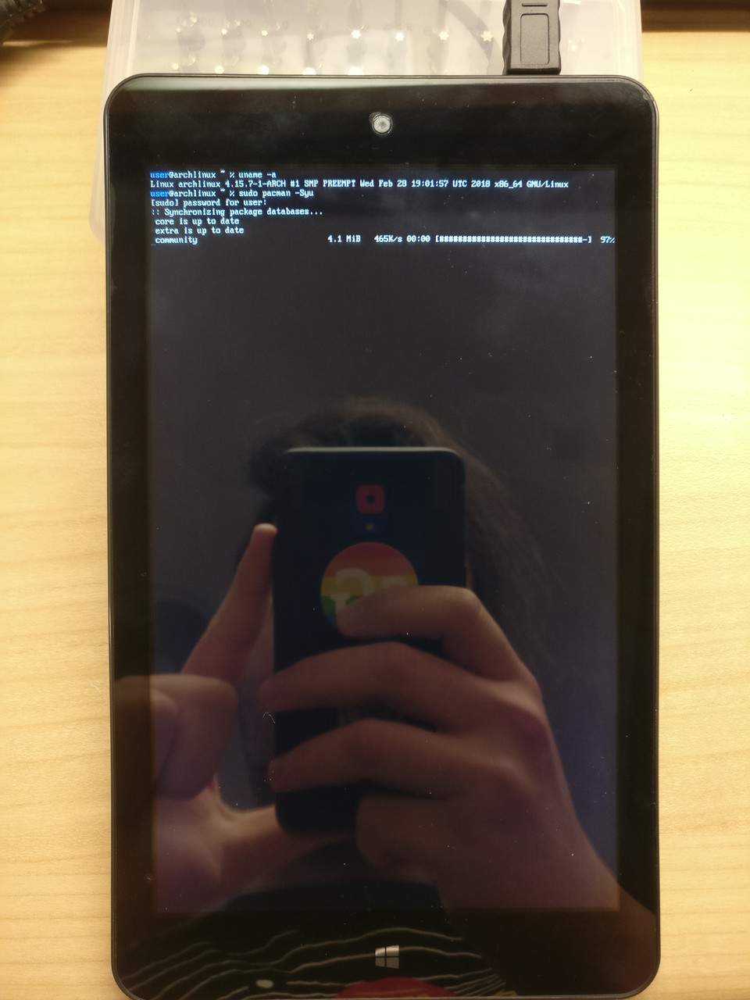

# Installing Arch Linux on a Pipo W7 Tablet
Yesterday I bough the cheapest tablet I could find at one of the stalls at
[Golden Computer Arcade, Hong Kong](https://en.tripadvisor.com.hk/Attraction_Review-g294217-d3749584-Reviews-Golden_Computer_Arcade-Hong_Kong.html).
It's a [PIPO W7](https://www.pipo-store.com/pipo-w7-windows-8-1-1gb-16gb-tablet.html)
which ran Windows. Although it was super cheap (389 HKD = 49.63 USD = 40.33 Euro)
it was reasonably performant.

When I bought it, I asked the seller whether it can run Linux. He responded "no",
but I think he meant that currently no Linux is installed, but Windows.

## Specification

| Spec    | Value                                                                      |
|---------|----------------------------------------------------------------------------|
| CPU     | 1.33GHz Intel Atom Z3735G Quad Core 2MB L2 Cache                           |
| RAM     | 1GB                                                                        |
| GPU     | Intel HD Z3700 Series                                                      |
| ROM     | 16GB                                                                       |
| Screen  | 7 Inch 1280x800 IPS capacitive multi touch                                 |
| Battery | 3Ah                                                                        |
| Wifi    | 802.11 b/g/n                                                               |
| Misc    | Bluetooth, USB OTG, Mini HDMI, Gravity Sensor, 3.5mmA Audio Jack, Micro SD |

## Booting from USB
In the box was next to the Tablet itself the Mirco-USB charging cable and a
Micro-USB OTG cable. This is needed for getting into the system setting, because
you can only boot into them by pressing *Esc* or *Del* at boot.

In my case, stuff like *Secure Boot* was not enabled, but I may be different for you.
The first thing I did was disabling *Quiet Boot* just to be greeted by the nice
American Megatrends screen every boot.





At the Golden Computer Arcade I also bought a USB3.0 hub, so I can simultaneously
connect a keyboard and the boot stick. I also could have tried booting from SD card,
but I didn't.

In the *Save & Exit* tab is a section called *Boot Override* where you also can
choose a bootable USB stick, if plugged in. In the beginning I tried and failed
to boot from a normal boot stick I created with *dd*. I first I thought that the
hardware is still locket to a specific kernel signature, although Secure Boot is
inactive.

After some googling around I found out that in order too boot stuff on this or
similar machines, I need something with a **32-Bit UEFI** comaptible bootloader.

When searching for "32 bit efi arch" I found this [Arch Wiki Article](https://wiki.archlinux.org/index.php/ASUS_x205ta).
They describe the same problem for a different pice of hardware, so i gave it a
shot.

### Creating a 32-Bit UEFI comaptible Live Boot Stick
1. Download Arch Linux
2. Create bootia32.efi
3. Copy everything to an USB stick

I like to write code listing so that they can be easily copypastad. Please do so
at own risk. Some values, links etc. may be out of date. Instead of executing the
code listing, you can also follow the instruction from the [Arch Wiki Article](https://wiki.archlinux.org/index.php/ASUS_x205ta).
```bash
# parameters
date=2018.03.01
iso=archlinux-$date-x86_64.iso
stick=/dev/sdb
point=/mnt/usb0
# download Arch Linux
wget http://mirrors.evowise.com/archlinux/iso/$date/$iso
label=$(isoinfo -i $iso -d | grep "Volume id" | grep -o "\w*$")
# create bootia32.efi
echo "
    insmod part_gpt
    insmod part_msdos
    insmod fat
    insmod efi_gop
    insmod efi_uga
    insmod video_bochs
    insmod video_cirrus
    insmod font

    if loadfont \"${prefix}/fonts/unicode.pf2\" ; then
      insmod gfxterm
      set gfxmode=\"1024x768x32;auto\"
      terminal_input console
      terminal_output gfxterm
    fi

    menuentry \"Arch Linux archiso x86_64\" {
      set gfxpayload=keep
      search --no-floppy --set=root --label $label
      linux /arch/boot/x86_64/vmlinuz archisobasedir=arch archisolabel=$label add_efi_memmap
      initrd /arch/boot/x86_64/archiso.img
    }

    menuentry \"UEFI Shell x86_64 v2\" {
      search --no-floppy --set=root --label $label
      chainloader /EFI/shellx64_v2.efi
    }

    menuentry \"UEFI Shell x86_64 v1\" {
      search --no-floppy --set=root --label $label
      chainloader /EFI/shellx64_v1.efi
    }" > /tmp/grub.cfg
grub-mkstandalone \
    -d /usr/lib/grub/i386-efi/ -O i386-efi\
    --modules="part_gpt part_msdos"\
    --fonts="unicode"\
    --locales="uk"\
    --themes=""\
    -o "/tmp/bootia32.efi"\
    "boot/grub/grub.cfg=/tmp/grub.cfg" -v
# partition and format USB stick
sudo fdisk /dev/sdb << EEOF
g
n


t
1
w
EEOF
sudo partprobe
sudo mkfs.vfat -F 32 -n $label "$stick"1
# copy everything to USB stick
sudo mount "$stick"1 $point
sudo bsdtar xf $iso \
--exclude=isolinux/ \
--exclude=EFI/archiso/ \
--exclude=arch/boot/syslinux/ \
-C $point
sudo cp /tmp/bootia32.efi $point/EFI/boot/bootia32.efi
sync
sudo eject $stick
```

The stick we now created we can boot from.

## Installing Arch Linux
Since the actual installation also needs a 32-Bit UEFI comaptible bootloader,
installing Arch is not as trivial. Again, after some search, I found an[Medium Post](https://medium.com/@emerino/archlinux-on-the-lattepanda-32-bit-efi-bootloader-cba651b661fd)
that descibes exactly that.

During your normal Arch installation you usually come to the point where you install
the bootloader. In most cases either GRUB or systemd-boot. We will install GRUB.
For the following commands I assume, you have **arch-chroot** ed into the installation.
I also assume that /boot will be your [EFI System Partition](https://wiki.archlinux.org/index.php/EFI_System_Partition)

```bash
pacman -S efibootmgr grub
grub-install \
    --target=i386-efi \
    --efi-directory=/boot \
    --bootloader-id=Archlinux
grub-mkconfig -o /boot/grub/grub.cfg
```




## Setup

This is how far I am at the moment. I still need to figure out how to configure
the touch screen and remap the powerbutton for example. But in the next picture
you can the running Arch installation performing an upgrade over the built-in
Wifi Module.

